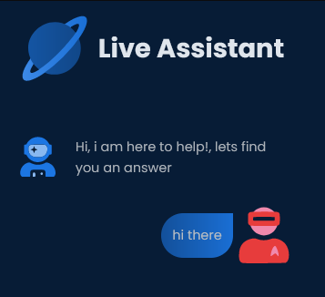

## Hi, I'm @Babbili 

I'm a Full Stack Web Developer, I spend most of time coding awesome Webapps  

📫 How to reach me! 

### Top Technologies Used

 

 
 
 
 
 
 
 
 
 
 
 

___

## Projects

- ### [giftandmore.shop](https://giftandmore.shop)
  <small>https://giftandmore.shop</small> 

> Node Js MVC pattern ecommerce Webapp  
> Pleasant mobile responsive UX/UI, animation on scroll 
> PayPal service-side integration 
> NGINX server with Cyber security configuration  <small> *XSS attacks prevntion, input sanitization, CSP*</small> 
>SEO through code, ld+JSON schema.org markups

 

- ### [Live Assistant](https://live-assistant-60875.web.app) 
  <small>https://live-assistant-60875.web.app</small> 

>React Js Firebase live chat assistant PWA 
>Workbox as ServiceWorker 
>Cool gradient colors SVG's animated with GSAP3

